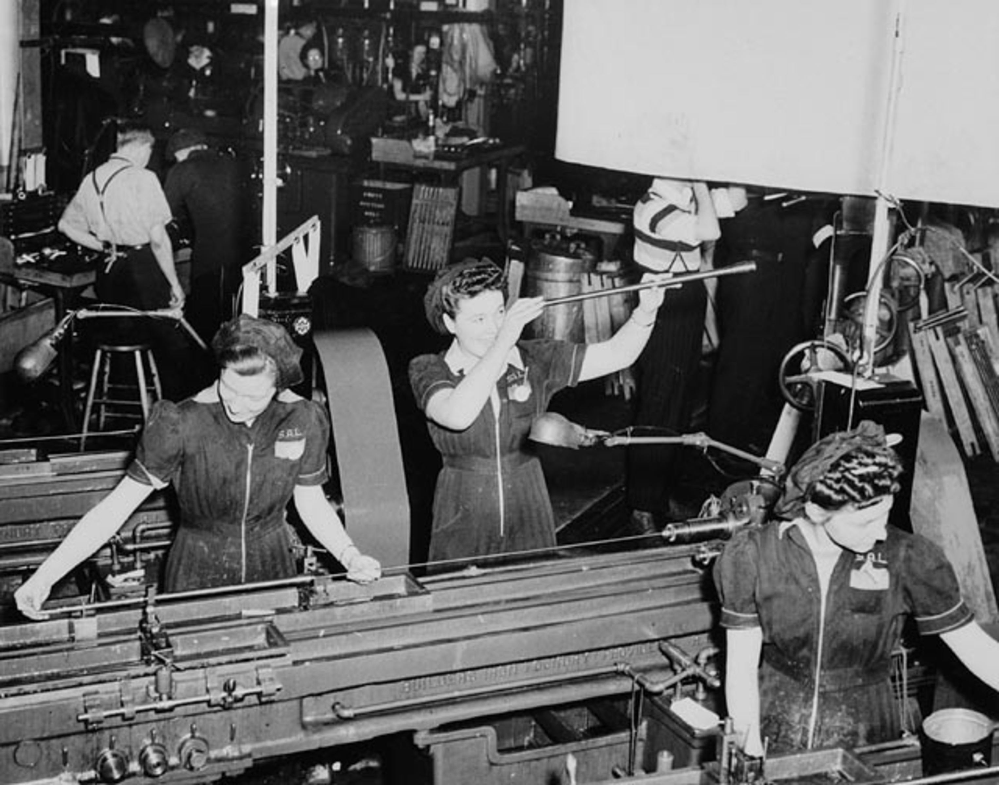
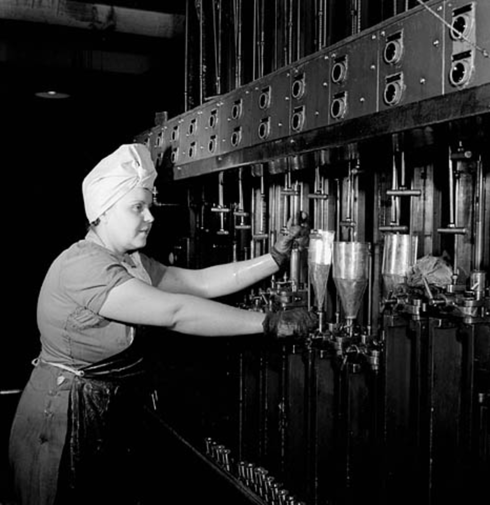

# WorkspaceAlberta

  
  

<em>Canadian industrial war production, via Library and Archives Canada.</em>

## Canada Is Going to Work

You might have heard the world is going to **WAR**.

Well, Canada is going to **WORK**.

Workspace Alberta is built for how Canadian businesses actually work: real tools, real workflows, and measurable productivity in the places where value gets created.

---

## The Last Mile of Work

AI promised 5X productivity. Most small businesses got a chatbot that writes mediocre marketing copy.

The model isn't the bottleneck. The connection is.

Wiring up your QuickBooks to your calendar to your AI costs $150/hour. You need a developer. Most small businesses will never do this. That's the gap. That's where the 5X productivity is hiding.

**WorkspaceAlberta solves the last mile** - pre-configured workspaces that already speak to the places where the work is.

---

## "Wouldn't It Be Great If..."

This is not a prompt library.

It is the sentence a business owner says when they can feel the friction in the operation but do not yet have the wiring to remove it.

"Wouldn't it be great if..." is not marketing copy. It is the bottleneck, stated plainly.

The job of this workspace is to turn that sentence into faster decisions, fewer missed opportunities, and more useful output from the people already doing the work.

---

## Why This Matters

Get 50% of the population 10% better. Every year. That's generational growth.

Not 10 developers 500% better. That's happening. But it doesn't scale to the economy.

*"How do I save 5 hours a week?" "How do I save $700 a month?"*

Those are the real questions. This is how you answer them.

---

## No New Subscription. No New Password. No New System to Learn.

Business owners don't need another app, another login, or another workflow builder that might write an OK-ish blog post. They need to solve actual problems.

WorkspaceAlberta is like Word, but for solving problems.

It's a program you open almost every day to work on one specific *"wouldn't it be great if..."* problem - the kind that's unique to your trade, your shop, your contracts.

---

## The Opportunity

Alberta's **Steel, Lumber, and Metals** industries represent over **2,500 companies** with a combined economic impact exceeding **$37 billion annually**.

| Sector | Companies | Economic Impact | Jobs Supported |
|--------|-----------|-----------------|----------------|
| Forestry & Wood Products | 676+ businesses, 40 major mills | $14 billion | 41,400 |
| Fabricated Metal Products | 1,871 establishments | $23.4B (mfg sector) | 16,600 |
| Primary & Machinery Manufacturing | 200+ facilities | Included above | 12,000+ |

Behind every one of these companies are dozens of systems that need to talk to each other just to get anything done: quoting software, inventory spreadsheets, accounting packages, project trackers, supplier portals, government tender databases.

Any tool that helps a fabricator **create demand**, a mill **manufacture more efficiently**, or a contractor **cut costs** has multiplier effects across the entire province:

- **$4 billion** in forest product exports alone - shipped to the US, China, Japan, and South Korea
- **$1.6 billion** in annual wages paid to forestry workers
- **70 communities** across Alberta that depend directly on these industries
- **$988 million** in tax revenue flowing back to the province

More contracts won. More jobs kept. More skill developed. More value staying here at home.

---

## What This Actually Does

WorkspaceAlberta is a procurement workspace for Canadian businesses.

It brings federal opportunity discovery closer to the people who actually have to price the work, judge the fit, assess the deadlines, and decide whether to bid.

The point is not to impress someone with an AI demo. The point is to help a real company:

- see relevant public-sector demand sooner
- understand requirements faster
- make better bid or no-bid decisions
- miss fewer deadlines
- keep more work moving

---

## Federal Contract Intelligence

The workspace includes direct integration with **CanadaBuys**, the federal government's procurement database. Your assistant can:

- pull live tender notices for steel, lumber, and aluminum across Alberta
- filter opportunities by UNSPSC codes and industry keywords
- analyze contract requirements against your actual capabilities
- flag deadlines and compliance requirements before you miss them

---

## Built for Trades, Not Tech

This isn't another SaaS dashboard. There's no monthly fee, no login portal, no "upgrade to Pro" nonsense.

You download it. You open it. You work.

The workspace runs locally on your machine or in a cloud development environment. Your data stays yours. The AI reads only what you authorize and nothing else.

---

## Technical Notes

Technical setup for Codex/OpenClaw lives in [`AGENTS.md`](AGENTS.md) and [`docs/codex-setup.md`](docs/codex-setup.md).

Image source notes live in [`docs/imagery-sources.md`](docs/imagery-sources.md).

---

## The Last Mile

Every efficiency gained by an Alberta fabricator, mill, or contractor ripples outward.

Faster quotes = more bids submitted. Better inventory = less waste. Automated compliance = fewer missed opportunities.

This isn't replacing workers with AI. It's operational leverage for the people doing the actual work.

The last mile is where the real work lives. We're building the wiring.

**Canada is going to work.**

*Data sources: [Statistics Canada](https://www150.statcan.gc.ca), [Innovation Canada](https://ised-isde.canada.ca), [Alberta Forest Products Association](https://albertaforestproducts.ca), [Job Bank Canada](https://www.jobbank.gc.ca)*
