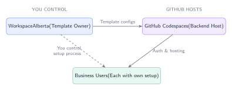
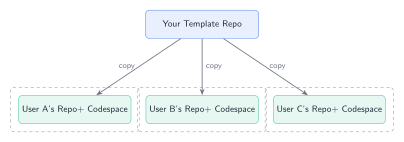
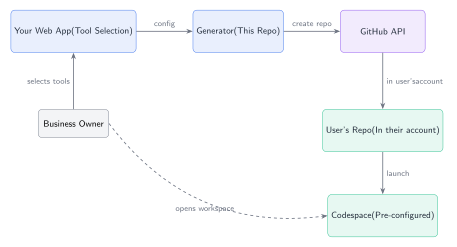
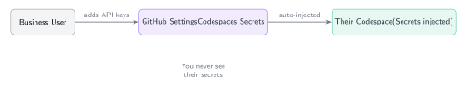

# Authentication and Multi-User Model for WorkspaceAlberta

## The Model



**Key Insight:** GitHub handles ALL authentication. You control the TEMPLATE, not the backend.

---

## How Authentication Works

### 1. Users Authenticate with GitHub (Not You)

**Each business user logs in with their own GitHub account.** You never handle their passwords or authentication directly.

- User creates a free GitHub account (if they don't have one)
- GitHub handles all authentication (including 2FA, SSO if they want)
- You never see their credentials

### 2. User Isolation



Each user gets their own complete copy:
- Their own repository (in their GitHub account)
- Their own Codespace (their own container instance)
- Their own secrets (stored in their GitHub settings)
- Their own billing (they pay GitHub directly)

### 3. Two Ways Users Get Their Own Workspace

#### Option A: Template Repository (Simplest)

1. You create a **template repository** with your devcontainer + MCP config
2. User clicks "Use this template" button
3. GitHub creates a **copy in their account**
4. User opens that copy in Codespaces
5. Result: They own the repo, they pay for Codespace usage

**User Flow:**
1. User visits your template repo on GitHub
2. Clicks "Use this template" > "Create a new repository"
3. Names their repo, chooses public/private
4. GitHub creates an independent copy in their account
5. User clicks "Code" > "Codespaces" > "Create codespace"
6. Done - they have a fully configured workspace

#### Option B: API-Generated Personalized Repos (Advanced)



1. User signs into your web app via GitHub OAuth
2. Your app collects their tool preferences
3. Your app uses GitHub API to create a personalized repo for them
4. User opens that repo in Codespaces

---

## How Secrets/API Keys Work



### Each User Manages Their Own Secrets

GitHub Codespaces has built-in secrets management. **Users add their own API keys in their GitHub settings - you never see these keys.**

#### Where Users Add Secrets

**Personal Codespaces Secrets (User Level):**
```
github.com/settings/codespaces > Codespaces secrets > New secret
```

These secrets are:
- Stored encrypted by GitHub
- Never visible in logs
- Injected as environment variables when Codespace starts
- **Only accessible to that user's Codespaces**

#### Example User Setup

When User A opens their Codespace, they see a prompt or docs telling them:

| Secret Name       | Where to Get It                          |
|-------------------|------------------------------------------|
| STRIPE_API_KEY    | stripe.com/dashboard/apikeys            |
| GOOGLE_CLIENT_ID  | console.cloud.google.com/credentials    |
| ANTHROPIC_API_KEY | console.anthropic.com                   |

The user adds these **to their own GitHub account**. When they open any Codespace that requests these secrets, they're automatically available.

---

## User Isolation: Complete Separation

Each user has:

| Component | Isolated? | Notes |
|-----------|-----------|-------|
| GitHub Account | YES | Their own login, 2FA, etc. |
| Repository | YES | Copy in their account (or org) |
| Codespace | YES | Their own container instance |
| Secrets | YES | Stored in their GitHub settings |
| Files/Data | YES | In their repo/codespace only |
| Billing | YES | They pay (or their org pays) |
| MCP Connections | YES | Use their own API keys |

**You cannot see:**
- Their code changes
- Their secrets
- Their data
- Their Codespace contents

**You control:**
- The initial template/configuration
- Which MCP servers are pre-configured
- The documentation and onboarding
- Updates to the template (they can pull changes if they want)

---

## Billing Model

### Option 1: Users Pay GitHub Directly (Simplest)

- Each user has their own Codespaces billing
- GitHub Free: 120 core-hours/month + 15GB storage free
- After that: ~$0.18/hour for 2-core machine

**Your Cost: $0** (except template repo storage, which is pennies)

### Option 2: Organization-Paid (For Enterprise)

If you want to pay for users' Codespaces:

1. Create a GitHub Organization
2. Add users as members or outside collaborators
3. Enable "organization pays for codespaces"
4. Set spending limits

**Your Cost:** Based on users' Codespace usage

### Option 3: Hybrid

- Free tier: Users pay themselves
- Premium tier: You create org, you pay, you add premium features

---

## Implementation: Two Approaches

### Approach 1: Single Public Template (Easiest)

**Setup:**
1. Push `codespace-template/` to a public GitHub repo
2. Mark it as a "Template repository" in settings
3. Share the "Use this template" link with customers

**Pros:**
- Zero backend infrastructure
- Users self-service
- Complete isolation automatically

**Cons:**
- Same config for everyone
- Can't personalize per-user

### Approach 2: Generated Personalized Repos (More Control)

**Setup:**
1. Build a web app with GitHub OAuth
2. User selects tools, describes problem
3. Your app uses GitHub API to:
   - Create repo from template in user's account
   - Customize devcontainer.json with their tools
   - Add personalized docs

**GitHub API Flow:**
```javascript
// 1. User authenticates via GitHub OAuth
// Your app receives an access token

// 2. Create repo from template
const response = await octokit.request('POST /repos/{template_owner}/{template_repo}/generate', {
  template_owner: 'WorkspaceAlberta',
  template_repo: 'business-workspace-template',
  owner: user.github_username,  // Goes in THEIR account
  name: 'my-business-workspace',
  private: true
});

// 3. Update files with personalization
await octokit.request('PUT /repos/{owner}/{repo}/contents/{path}', {
  owner: user.github_username,
  repo: 'my-business-workspace',
  path: '.devcontainer/devcontainer.json',
  message: 'Personalized workspace configuration',
  content: base64encode(customizedDevcontainer)
});

// 4. Send user to their new repo
redirect(`https://github.com/${user.github_username}/my-business-workspace`);
// Or directly to Codespaces:
redirect(`https://codespaces.new/${user.github_username}/my-business-workspace`);
```

**Pros:**
- Personalized per user
- You can track which tools are popular
- Can upsell premium features

**Cons:**
- Requires web app backend
- More complex OAuth flow

---

## Security Summary

| Concern | How It's Handled |
|---------|-----------------|
| User passwords | GitHub handles it (you never see them) |
| API keys/secrets | Stored in user's GitHub account (encrypted) |
| Data isolation | Each user has separate repo + codespace |
| Access control | GitHub's permission system |
| Network isolation | Each Codespace is isolated container |
| Billing fraud | Each user pays their own usage |

---

## FAQ

### Q: Do users need to know Git/GitHub?
**A:** Minimal - they need a GitHub account and click "Create codespace". No git commands required.

### Q: What if a user doesn't have a GitHub account?
**A:** They create one (free). Takes 2 minutes.

### Q: Can I see what users are doing in their workspaces?
**A:** No. Once they create from your template, it's their repo in their account.

### Q: Can I update their workspace after they create it?
**A:** Not directly. You can update your template, and they can choose to pull changes.

### Q: What about enterprise SSO users?
**A:** Works fine - they authenticate through their SSO provider to GitHub.

### Q: Can multiple team members share one workspace?
**A:** Yes - they add team members as collaborators on their repo, or use a shared GitHub org.

---

## Recommended Starting Point

**Start with Approach 1 (Template Repository):**

1. Finalize `codespace-template/` in this repo
2. Create a new public repo: `WorkspaceAlberta/business-workspace`
3. Copy template files there
4. Mark as template repository
5. Share the link: `github.com/WorkspaceAlberta/business-workspace`

Users click "Use this template" -> instant personalized workspace.

**Then add Approach 2** when you want personalization.

---

## Diagrams

All diagrams are rendered from TikZ source files:
- Source: `diagrams/src/*.tex`
- Output: `diagrams/output/*.svg`
- Renderer: `python diagrams/render-tikz.py`
