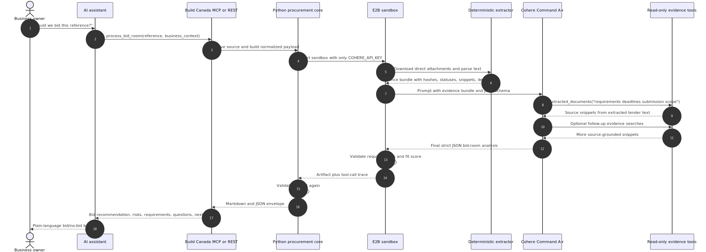
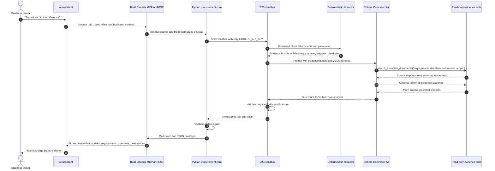
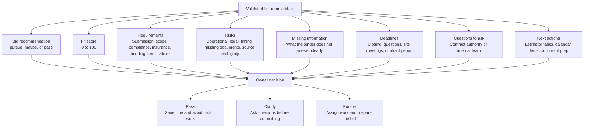

# Bid Room Operating Diagram

This is the business-owner view of the Build Canada MCP bid room: what gets set up, what happens every day, what happens when a tender looks promising, and where the AI is allowed to act.

The goal is practical: help an owner or estimator move from "what work is open?" to "should we bid, and what do we do next?" without losing source evidence, deadlines, or control.

## Rendered Mermaid Ink Images

These SVGs are rendered from the Mermaid source in this file and stored locally so the diagrams do not disappear if an external render URL changes.

### System and business flow

### Cohere tool-calling loop inside E2B

### Owner-facing bid-room artifact

## System And Business Flow

```mermaid
flowchart LR
    Owner["Business owner or estimator"]
    Profile["Business profile<br/>Capabilities, location, trade, service radius, risk appetite"]
    Assistant["AI assistant<br/>Codex, OpenClaw, Hermes, Cursor, or another MCP client"]

    subgraph Product["Build Canada MCP product endpoint"]
        MCP["Custom procurement MCP server<br/>Agent-native tool surface"]
        REST["REST/OpenAPI adapter<br/>Fallback surface for non-MCP tools"]
        Core["Shared Python procurement core<br/>No model dependency for search, filters, matching, briefs"]
    end

    subgraph Sources["Public procurement sources"]
        CanadaBuys["CanadaBuys<br/>Federal opportunities, notices, direct attachment URLs"]
        APC["Alberta Purchasing Connection<br/>Provincial opportunities, metadata, public external links"]
    end

    subgraph FastLoop["Daily operating loop"]
        Search["search_opportunities<br/>Find work across federal and Alberta sources"]
        Deadlines["list_deadlines<br/>Surface closing dates and urgency"]
        Matches["find_matching_opportunities<br/>Rank against profile and business context"]
        Brief["daily_bid_brief<br/>Owner-ready daily market signal"]
    end

    subgraph BidRoom["Heavy bid-room loop"]
        Process["process_bid_room<br/>Resolve reference and create isolated job"]
        E2B["Short-lived E2B sandbox<br/>Unknown files stay outside the always-on service"]
        Extract["Deterministic extraction<br/>Download, hash, size-check, parse PDF, HTML, TXT, DOCX, XLSX, ZIP"]
        Evidence["Evidence bundle<br/>Document status, SHA256, deadlines, requirement-like lines, source snippets"]
        Cohere["Cohere Command A+<br/>Canadian model reasoning inside E2B"]
        Tools["Read-only evidence tools<br/>search_extracted_documents<br/>get_bid_evidence"]
        Validate["Double validation<br/>Strict JSON in sandbox, then host validation"]
        Artifact["Bid-room artifact<br/>Recommendation, fit score, requirements, risks, missing info, questions, next actions"]
    end

    subgraph Decision["Owner decision path"]
        NoBid["Pass<br/>Document why, avoid bad fit"]
        Maybe["Maybe<br/>Ask clarifying questions, fill missing info"]
        Bid["Pursue<br/>Assign estimator, calendar deadlines, prepare compliance package"]
        Community["Daily habit and community<br/>Free bid brief first, pricing only after trust"]
    end

    Owner --> Profile
    Owner --> Assistant
    Assistant --> MCP
    Assistant --> REST
    MCP --> Core
    REST --> Core
    Core --> CanadaBuys
    Core --> APC

    Core --> Search
    Core --> Deadlines
    Core --> Matches
    Core --> Brief
    Brief --> Owner
    Search --> Matches
    Deadlines --> Matches
    Matches --> Process

    Process --> E2B
    E2B --> Extract
    Extract --> Evidence
    Evidence --> Cohere
    Cohere --> Tools
    Tools --> Evidence
    Cohere --> Validate
    Validate --> Artifact
    Artifact --> Assistant
    Assistant --> Owner

    Artifact --> NoBid
    Artifact --> Maybe
    Artifact --> Bid
    NoBid --> Community
    Maybe --> Community
    Bid --> Community

    classDef human fill:#f7f3e8,stroke:#7a5c2e,color:#1e1e1e
    classDef product fill:#e7f0ff,stroke:#235a9f,color:#10243d
    classDef source fill:#eef8ef,stroke:#2d7a35,color:#102d14
    classDef compute fill:#f2ecff,stroke:#6845a5,color:#24143d
    classDef decision fill:#fff1e6,stroke:#b45f06,color:#331800

    class Owner,Profile,Assistant human
    class MCP,REST,Core,Search,Deadlines,Matches,Brief product
    class CanadaBuys,APC source
    class Process,E2B,Extract,Evidence,Cohere,Tools,Validate,Artifact compute
    class NoBid,Maybe,Bid,Community decision
```

## Cohere Tool-Calling Loop Inside E2B

## What The Owner Gets Back

## Control Boundaries

- The MCP/REST endpoint is the always-on product surface.
- E2B is temporary isolated compute for tender documents and attachments.
- Python performs deterministic source lookup, attachment limits, hashing, extraction, evidence building, and validation.
- Cohere performs bid reasoning over extracted evidence and read-only tool results.
- Only `COHERE_API_KEY` is injected into E2B for v1.
- The host does not trust the model blindly; it validates the returned JSON before serving it to the user.
